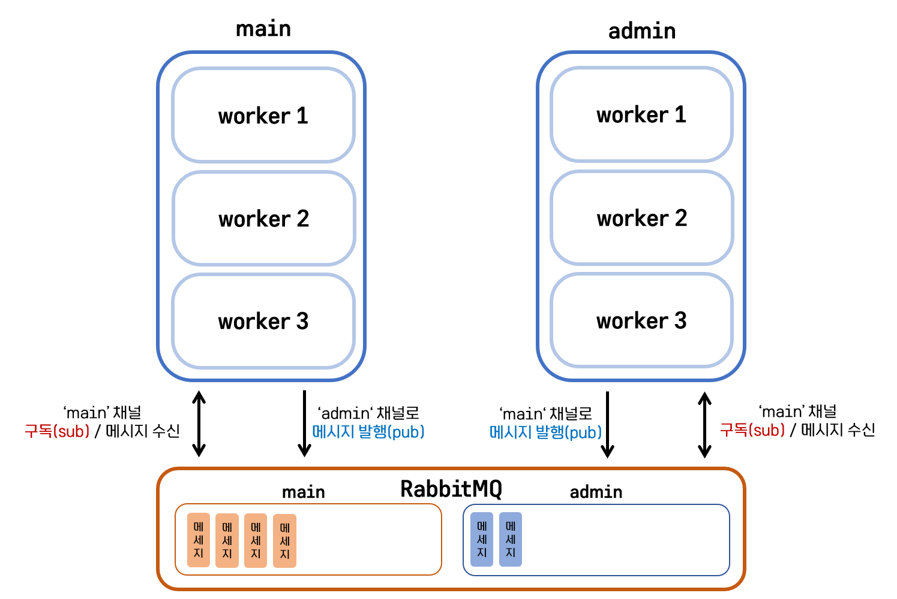

# 🍀 Python MSA
python으로 microservice example을 만들어 보고 모놀리틱과 마이크로서비스가 무엇인지 알아보자

아래와 같은 아키텍처를 가진 서비스를 제작해 볼 것이다.

admin app과 main app을 제작할 것인데, admin app은 django, main app은 flask로 개발할 것이다.

- 각 기능마다 mysql 데이터베이스를 가지고 있고
- rabbitmq event로 정보를 교환할 것이며
- main app은 admin app에게 내부적으로 api 요청을 보낼 것이다.

### 모놀리틱 앱
모놀리틱은 많은 기능을 가진 큰 코드의 베이스가 될 수 있다.
또한 하나의 큰 베이터베이스와 연결된다.

모놀리틱 앱은
- 많은 트래픽이 생기는 검색 기능
- 캐시되는 제품 리스트
- 머신 러닝을 이용한 제품 추천 기능, 
- 트래픽이 적은 contact 페이지

과 같은 기능들을 하나의 앱(레포지토리)에 넣는 방식이다.

그렇기 때문에 몇가지 문제가 있다.
1. 하나의 언어로만 작성 되어야함 (python, java, go etc.)
2. scale up을 하려면 모든 기능(트래픽이 적은 기능도)을 복제해야함
3. 하나의 기능에서 장애가 발생하면 모든 기능이 다운된다.

### 마이크로 서비스 앱
마이크로 서비스는 
- 기능마다의 데이터베이스를 가진다
- 기능이 서로에게 의존적이지 않다 (각 독립적인 역할을 수행한다.)
- 이벤트 버스(event bus)를 사용해 각 노드끼리 서로 통신한다.

이런 특성은 여러 장점을 가진다.
1. 만약 검색 기능에 많은 트래픽이 발생하여 scale up 하고 싶다면 검색 기능 인스턴스만 scale up 하면 된다.
2. 각 기능 별로 다른 언어로 개발할 수 있다.
3. 하나의 기능에서 장애가 발생해도 다른 기능에 영향을 끼치지 않는다.
